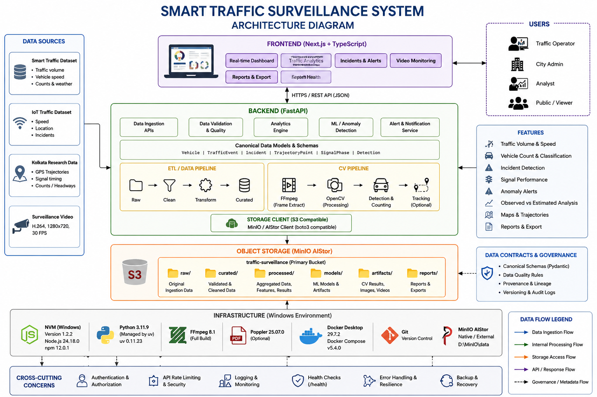

# 🚦 Smart Traffic Surveillance


A Big Data Analytics platform for intelligent traffic monitoring, object storage, analytics, anomaly detection, incident review, and operational visualization. The project combines raw traffic, GPS, and video datasets with a MinIO-backed storage layer, a FastAPI analytics service, and a Next.js control-room dashboard.

## Overview

This project implements a dataset-driven smart traffic surveillance workflow that ingests real traffic-related data, validates and processes it, stores it in a MinIO S3-compatible object store, and exposes analytics and retrieval endpoints for operational monitoring.

The active runtime uses the Dockerized MinIO deployment included with this repository. The native installation at D:\MinIO is preserved separately and is intentionally not used by this project.

## 🏗️ System Architecture



The architecture is organized into the following layers:

1. Data Sources: traffic datasets, GPS/trajectory logs, and CCTV/video assets.
2. Frontend: a Next.js dashboard for monitoring traffic, incidents, signals, map data, and reports.
3. FastAPI Backend: ingestion, validation, analytics, health checks, and storage access APIs.
4. Processing / Analytics: summarization, anomaly detection, operational reports, and retrieval logic.
5. MinIO Object Storage: bucket-based storage for raw, derived, and operational artifacts.
6. Docker Infrastructure: the project runtime is containerized and runs as a local Compose stack.
7. Cross-cutting concerns: health endpoints, retrieval APIs, dataset preservation, auditability, and local runtime configuration.

## Core features

| Feature | Description |
| --- | --- |
| Traffic Monitoring | Traffic volume and speed visualization |
| Vehicle Analytics | Vehicle-related monitoring and analysis |
| Anomaly Detection | Identification of abnormal traffic conditions |
| Incident Management | Incident and violation reporting |
| Signal Monitoring | Traffic signal status and operating data |
| Video Monitoring | CCTV/video dataset handling |
| GPS / Trajectory Data | Movement and route-based traffic data |
| Object Storage | MinIO-backed S3-compatible storage |
| Metadata | Object-level contextual metadata |
| Retrieval API | Backend object retrieval across buckets |
| Reports | Structured traffic operations reports |
| Health Monitoring | Backend readiness and health endpoints |

## Data sources

The project uses four primary preserved raw datasets under the repository data store:

| Dataset | Description |
| --- | --- |
| smart_traffic_management_dataset.csv | Structured traffic sensor and operational summary data |
| iot_edge_computing_public_management.csv | IoT / edge computing traffic management data |
| Kolkata_Data_PMC_paper_TrafficCountEstimationUsingCrowdSourcedTrajectory-v0.1.zip | GPS / trajectory dataset from the Kolkata traffic study |
| DLR_UT_120230_120300.mp4 | CCTV / junction video asset |

These datasets are used as the project’s live evidence base and remain preserved in the repository data layout.

## MinIO object storage

Object storage is used because the project involves a mix of structured, semi-structured, and unstructured data: CSVs, GPS logs, video, JSON reports, and derived operational artifacts. MinIO provides a lightweight S3-compatible backend for this workload and supports bucketized storage, metadata, and retrieval without introducing a separate cloud dependency.

The validated runtime contains six buckets:

- traffic-data
- cctv
- vehicle-images
- traffic-sensors
- gps-logs
- incident-reports

Representative object paths in the live environment include:

```text
cctv/junction-01/DLR_UT_120230_120300.mp4
vehicle-images/representative/vehicle-01.jpg
traffic-sensors/sensor-readings/smart_traffic_management_dataset.csv
gps-logs/kolkata/ds 1 F 20220108-114848.txt
incident-reports/speed-violations/speed-violations-demo.json
```

This layout is intentionally organized by data type and operational purpose rather than by a single flat object namespace.

## Object metadata

The project demonstrates object-level metadata using S3-compatible MinIO metadata fields. The validated metadata includes:

- Camera ID
- Junction Name
- Vehicle Number
- Timestamp
- Vehicle Type
- Speed
- Traffic Density

These metadata values are stored as MinIO object metadata and are retrieved alongside the object content through the storage API.

Runtime credentials are supplied through the local environment and are intentionally excluded from version control.

## Data flow

```text
Raw datasets
   ↓
Ingestion
   ↓
Validation / processing
   ↓
MinIO object storage
   ↓
FastAPI analytics and retrieval APIs
   ↓
Next.js operations dashboard
```

This data flow reflects the actual project implementation: raw files are processed and normalized, persisted in MinIO, then surfaced through backend endpoints and a frontend monitoring dashboard.

## API

The project exposes a set of operational and retrieval endpoints through FastAPI.

### Main endpoints

```text
GET /health
GET /ready

GET /api/v1/datasets
GET /api/v1/data-sources

GET /api/v1/analytics/summary
GET /api/v1/analytics/anomalies

GET /api/v1/vehicles
GET /api/v1/incidents
GET /api/v1/signals
GET /api/v1/map
GET /api/v1/video
GET /api/v1/reports

GET /api/v1/storage/buckets
GET /api/v1/storage/objects
GET /api/v1/storage/object
GET /api/v1/storage/retrieval
```

Swagger is available at:

- [Swagger UI](http://localhost:8000/docs)

## Quick start

From the project root:

```powershell
cd "D:\BDA_Smart_Traffic_Surveillance"
docker compose up -d --build
docker compose ps
```

Expected runtime services:

- traffic-backend
- traffic-frontend
- traffic-minio

Local runtime URLs:

- Frontend: [http://localhost:3000](http://localhost:3000)
- Backend: [http://localhost:8000](http://localhost:8000)
- Swagger: [http://localhost:8000/docs](http://localhost:8000/docs)
- MinIO Console: [http://localhost:9001](http://localhost:9001)
- MinIO API: [http://localhost:9000](http://localhost:9000)

## Validation

The following checks were verified in the validated project state:

### Backend

```powershell
cd backend
.\.venv\Scripts\python.exe -m pytest -q
```

### Frontend

```powershell
cd frontend
npm run build
```

### Runtime health

```powershell
curl.exe http://localhost:8000/health
curl.exe http://localhost:8000/ready
```

### Storage verification

```powershell
curl.exe http://localhost:8000/api/v1/storage/buckets
```

## Professor demo / evaluation flow

1. Start the Docker stack.
2. Open the dashboard at [http://localhost:3000](http://localhost:3000).
3. Show live traffic metrics and operational views.
4. Open Swagger at [http://localhost:8000/docs](http://localhost:8000/docs).
5. Demonstrate /health and /ready.
6. Open the MinIO Console at [http://localhost:9001](http://localhost:9001).
7. Show the six MinIO buckets.
8. Open CCTV footage and show the video object.
9. Open the vehicle image in vehicle-images.
10. Open the traffic sensor data object.
11. Open the GPS log object.
12. Open the incident report object.
13. Show object metadata and retrieval output.
14. Demonstrate the retrieval API for the required objects.
15. Show the architecture diagram and the project documentation files.

## Repository structure

```text
BDA_Smart_Traffic_Surveillance/
├── backend/
├── frontend/
├── data/
│   ├── raw/
│   └── derived/
├── docs/
│   └── architecture/
│       └── smart-traffic-surveillance-architecture.png
├── DEMO_GUIDE.md
├── PROJECT_REPORT.md
├── README.md
├── docker-compose.yml
└── .gitignore
```

## Documentation

- [DEMO_GUIDE.md](DEMO_GUIDE.md)
- [PROJECT_REPORT.md](PROJECT_REPORT.md)
- [Architecture Diagram](docs/architecture/smart-traffic-surveillance-architecture.png)

## Security notice

The project does not publish MinIO credentials or access secrets in the repository. Runtime credentials are supplied through the local environment and are intentionally excluded from version control.

## Project truth

This project is a validated, dataset-driven traffic monitoring system implemented with Docker, FastAPI, MinIO, and Next.js. It is not presented as a production cloud deployment, a streaming platform, or a broad-scale industrial system beyond the implemented scope. The project reflects the actual runtime and implementation validated in this repository.
